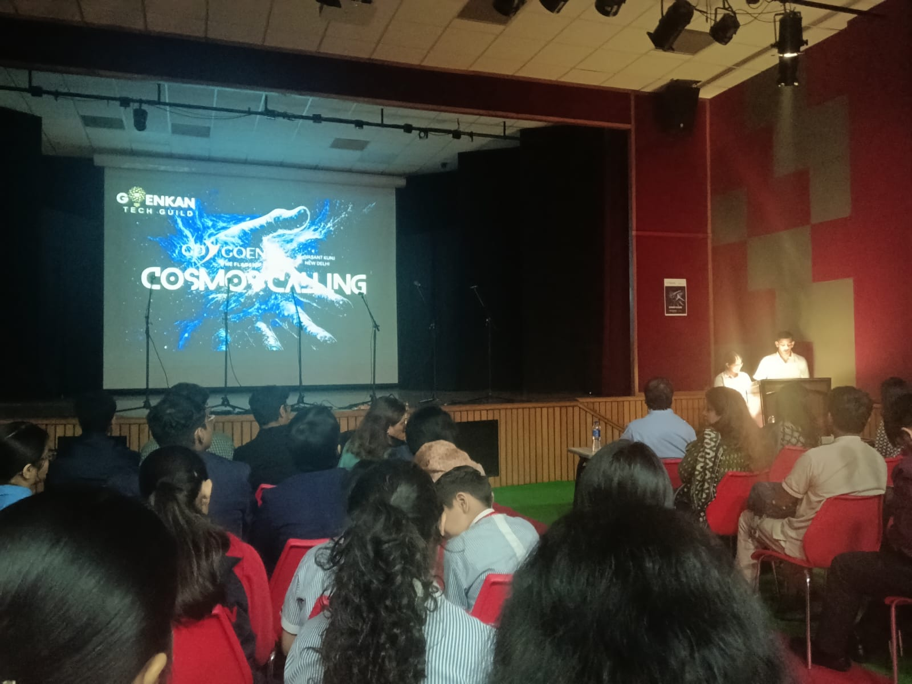
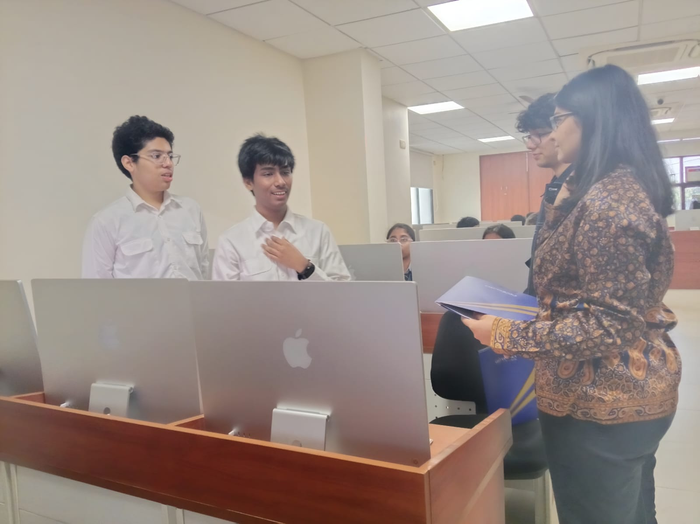

# 🚀 CosmoGuide AI — Space SOS Helper

CosmoGuide AI is your intelligent partner for overcoming any challenge—routine or emergency—beyond the boundaries of Earth. Engineered for astronauts, scientists, and explorers, it brings together reliable support, expertise, and connectivity crucial for deep space missions. Whether diagnosing malfunctions, facing health emergencies, or seeking expert advice, CosmoGuide AI is built for rapid, autonomous, and resilient help.

---

<div align="center" style="display:flex; justify-content:center; align-items:center; gap:40px; flex-wrap:nowrap;">

  <!-- Left Image -->
  <div style="border: 4px solid #00b7ff; box-shadow: 0 0 20px #00b7ff, 0 0 40px #0077ff; border-radius: 20px; padding: 5px;">
    
  </div>

  <!-- Middle Badges -->
  <div style="display:flex; flex-direction:column; align-items:center; justify-content:center; min-width:260px;">
    
    
    
    
    
  </div>

  <!-- Right Image -->
  <div style="border: 4px solid #ff9900; box-shadow: 0 0 20px #ff9900, 0 0 40px #ff6600; border-radius: 20px; padding: 5px;">
    
  </div>

</div>

---

## 🛠️ Tech Stack

- **Languages:** HTML, CSS, JavaScript  
- **Frameworks/Libraries:** Bootstrap, GSAP (for animations)  
- **Tools Used:** VS Code, GitHub Pages  
- **Focus Areas:** Futuristic UI, Responsive Design, Interactive Elements, Dynamic Lightning Effects  

---

## 🌌 Key Features

- ⚡ **AI-Powered Guidance:** Quick decision support for emergencies and technical challenges  
- 🛰️ **Space-Grade Interface:** Designed with a futuristic, cosmic theme  
- 💡 **Interactive Experience:** Blue lightning borders, hover transitions, and glowing animations  
- 🔧 **Customizable Design:** Easily tweak effects and visuals to fit any mission scenario  

---

## 📌 How to Use

1. Clone this repository:
   ```bash
   git clone https://github.com/AmulyaInnovates/CosmoGuide-AI.git
2. Open the `.java` files in your favorite Java IDE.
3. Compile & run to explore the functionality.

---

## 🤝 Collaboration & Connection

Whether you're building something with Java, exploring GUI frameworks, or just want to brainstorm ideas — I’d love to connect.

- 💬 Open to code reviews and pair programming  
- 🤝 Collaborations on Java-based utilities or systems welcome  
- 🚀 Happy to help or co-create  

---

## 📬 Contact

📧 Email: amulya.gupta.2556@gdgoenkarohini.edu.in  
🐙 GitHub: [AmulyaInnovates](https://github.com/AmulyaInnovates)

---

> *Beyond Earth, beyond limits — CosmoGuide AI lights the path through the unknown.*
